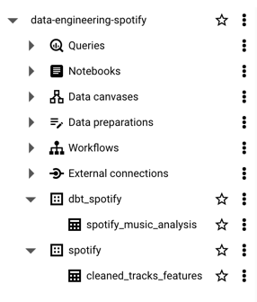
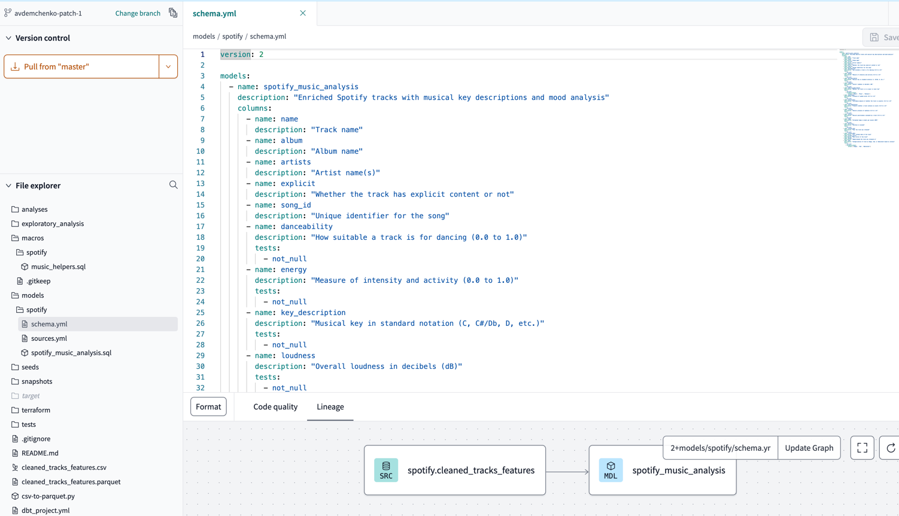
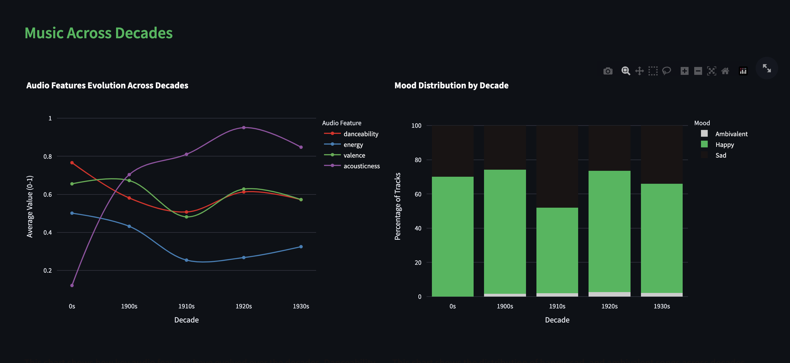
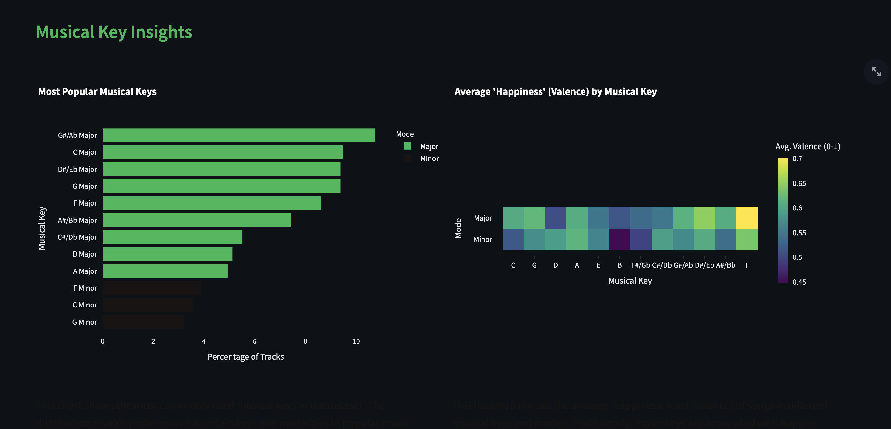

# Spotify Data Engineering Pipeline

This repository contains an end-to-end data engineering solution for analyzing Spotify music data. The project demonstrates a complete data pipeline from data extraction and transformation to analysis and visualization.

## Project Overview

This project implements a complete data engineering workflow:

1. **Data Ingestion**: Converting CSV data to Parquet format
2. **Cloud Storage**: Uploading data to Google Cloud Storage
3. **Data Warehousing**: Loading data into BigQuery
4. **Transformation**: Using dbt to model and enrich the data
5. **Visualization**: Interactive Streamlit dashboard for exploring music trends

## Repository Structure

```
spotify-data-engineering/
├── scripts/
│   ├── csv_to_parquet_gcp.py      # Converts CSV to Parquet and uploads to GCS
│   ├── check_table.py             # Utility to check BigQuery tables
│   ├── create_dbt_dataset.py      # Creates proper datasets in BigQuery
│   └── fix_dataset_location.py    # Fixes dataset location issues
├── exploratory_analysis/
│   └── spotify.ipynb     # Jupyter notebook with initial data exploration and preparation
├── models/
│   ├── spotify/
│   │   ├── spotify_music_analysis.sql  # Main dbt model
│   │   ├── sources.yml           # Source definitions
│   │   └── schema.yml            # Schema definitions
│   └── macros/
│       └── spotify/
│           └── music_helpers.sql  # SQL macros for music analysis
├── visualization/
│   ├── spotify_viz_app.py         # Streamlit visualization app
│   └── requirements.txt           # Python dependencies
└── README.md                      # Project documentation
```

## Key Components

### Exploratory Data Analysis

The `exploratory_analysis` folder contains Jupyter notebooks used for initial data exploration and preparation:

- **spotify.ipynb**: This notebook explores the raw Spotify dataset, performs data cleaning, and identifies key features for further analysis
- Includes data quality checks, feature distribution analysis, and preliminary insights that informed the subsequent pipeline development

### Data Conversion and Upload

The `csv_to_parquet_gcp.py` script handles the initial data transformation and cloud storage. It:

- Reads a CSV file containing Spotify track data
- Converts it to the more efficient Parquet format
- Uploads the Parquet file to a GCP bucket

```python
python scripts/csv_to_parquet_gcp.py
```

### Data Transformation with dbt

The dbt models in this project transform raw Spotify data into analytics-ready tables:

- **Spotify Music Analysis**: Enriches track data with musical key descriptions, modality information, and mood classification
- **Custom SQL Macros**: Converts numeric key values to musical notation and modal information

Key transformations include:
- Converting numeric keys (0-11) to musical notes (C, C#/Db, D, etc.)
- Mapping modality values (0-1) to Major/Minor classifications
- Categorizing tracks by mood based on valence values

To run the dbt models:

```bash
dbt run -m spotify_music_analysis
```

### Data Visualization with Streamlit

The Streamlit application provides an interactive dashboard for exploring:

- Audio feature trends across decades
- Mood distribution changes over time
- Musical key popularity and characteristics
- Correlations between different audio features
- Artist comparisons and insights

To run the visualization app:

```bash
cd visualization
pip install -r requirements.txt
streamlit run spotify_viz_app.py
```

## Setup Instructions

### Prerequisites

- Python 3.8+
- Google Cloud Platform account
- GCP project with BigQuery and Cloud Storage enabled
- Spotify track data (initial CSV file)

### Google Cloud Setup

1. Create a GCP project (e.g., `data-engineering-spotify`)
2. Create a GCS bucket for Parquet storage (e.g., `spotify-data-engineering-spotify`)
3. Enable BigQuery API
4. Set up authentication:
   ```bash
   gcloud auth application-default login
   ```

### Installing dbt

1. Install dbt with BigQuery adapter:
   ```bash
   pip install dbt-bigquery
   ```
2. Configure dbt profile in `~/.dbt/profiles.yml`:
   ```yaml
   spotify_dbt:
     outputs:
       default:
         type: bigquery
         method: oauth
         project: data-engineering-spotify
         dataset: dbt_spotify
         location: europe-west6
         threads: 4
     target: default
   ```

### Data Pipeline Setup

1. Clone this repository
2. Run the data conversion and upload script:
   ```bash
   python scripts/csv_to_parquet_gcp.py
   ```
3. Create the BigQuery dataset in the correct location:
   ```bash
   python scripts/fix_dataset_location.py
   ```
4. Run the dbt models:
   ```bash
   cd models
   dbt run
   ```



5. Launch the Streamlit app:
   ```bash
   cd visualization
   streamlit run spotify_viz_app.py
   ```




## Key Insights

This data pipeline enables exploration of several interesting aspects of music:

- How audio features like danceability, energy, and valence have evolved over decades
- The distribution and popularity of different musical keys and modes
- Correlations between audio characteristics
- Changes in musical mood and emotional tone across time periods
- Artist-specific audio fingerprints and characteristics

## Technical Challenges Solved

This project addressed several technical challenges:

1. **Data Location Issues**: Ensuring BigQuery datasets were in the same location for cross-dataset queries
2. **Authentication**: Implementing reliable authentication for GCP services
3. **Performance Optimization**: Creating efficient queries for visualization
4. **Data Type Handling**: Managing specialized BigQuery data types with db-dtypes
5. **F-string Syntax**: Correcting Python f-string expression syntax for SQL queries

## Future Enhancements

Potential extensions to this project:

- Genre analysis and classification
- Lyrical content analysis using NLP
- Artist similarity networks
- Recommendation system based on audio features
- Integration with live Spotify API data
- Automated data pipeline with Airflow or Cloud Composer

## Contributing

Contributions to improve the data pipeline, models, or visualization are welcome. Please feel free to submit a pull request or open an issue to discuss potential improvements.

## License

This project is licensed under the MIT License - see the LICENSE file for details.
